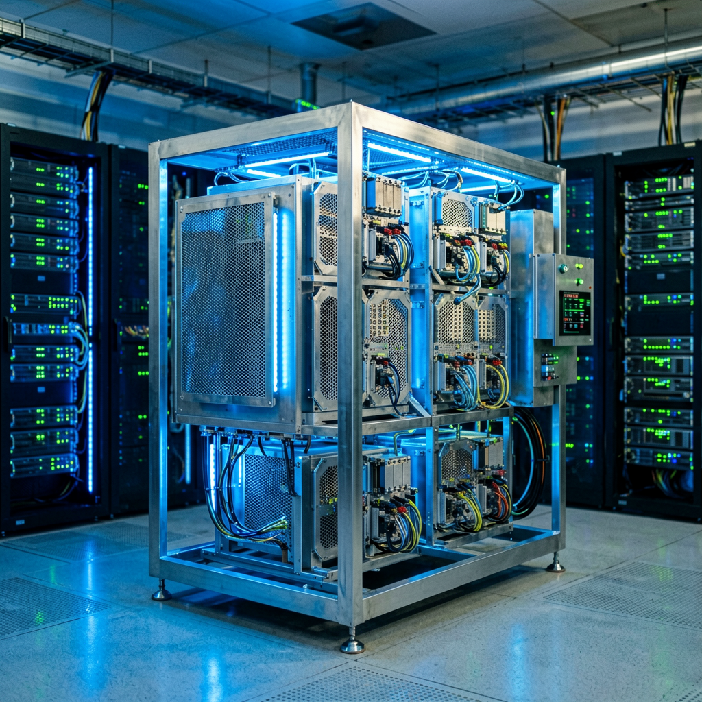

# 谷歌都缺算力了：AI 算力饥荒下，硅谷正在给客户「发配额」

> 2026年6月30日 | AI News Daily

---

## 一句话先说结论

**当一家拥有全球最大数据中心网络之一的公司——Google——开始限制另一家拥有全球最大数据中心网络之一的公司——Meta——使用自己的 AI 模型，这意味着「算力饥荒」已经从坊间传言变成了财务事实。**

---

## 这周到底发生了什么

6 月 29 日，财联社引述知情人士消息：**Google 已开始限制 Meta 对 Gemini 的使用**。原因不是政治，不是反垄断，也不是商业纠纷——而是 Meta 的算力需求超出了 Google 当前能够承载的范围。

这件事在大型云厂商之间极为罕见。

报道还披露：即便 Google 在持续追加 AI 基础设施投入，也无法满足客户日益激增的需求。**Meta 的多个 AI 项目因为 Gemini 配额被收紧而被迫推迟**。

---

## 把镜头拉远，看看这周的「算力饥荒」拼图

不是孤立事件。在同一周里：

- **BIS（美国工业与安全局）** 公开警示：美国本土算力增长速度，已经追不上 AI 模型训练和推理的需求增长。
- **AOC（亚历山德里娅·奥卡西奥-科尔特斯）** 在国会提议——直接拆分头部 AI 公司，让算力垄断不再绑定在一家或两家公司手里。
- **苹果** 6 月 28 日宣布：因为芯片采购成本压力，新一代 iPhone Air 和 Mac mini 集体涨价 50–100 美元。**这是消费电子第一次明确把「AI 芯片紧张」转嫁到终端用户**。
- **DeepSeek** 6 月 29 日宣布 V4 正式版 7 月中旬上线，同步引入「**峰谷定价**」机制——高峰时段（9–12 时、14–18 时）API 价格是非高峰时段的两倍。这是大模型 API 行业首次出现「分时段差价」。

**四个信号叠在一起，传达的是同一件事——AI 算力，正在从「资本可解决的问题」变成「物理硬约束」。**

---

## 数字盘点

下面这组数字是这场算力饥荒的「现场温度计」：

- **7000–7250 亿美元**：北美四大科技巨头 2026 年的 AI 资本开支总和。是过去任一年的 2 倍以上。
- **80%**：英伟达 FY2026 营收中数据中心业务占比。数据中心已经是 AI 算力的「主战场」。
- **2 倍**：DeepSeek V4 峰谷定价的高峰倍率。
- **50–100 美元**：苹果新一代 iPhone Air / Mac mini 涨价幅度。
- **多个项目延期**：Meta 由于 Gemini 配额收紧导致的项目影响范围。
- **4 倍**：DeepSeek + 北大开源的 DSpark 推理框架，单卡吞吐量提升上限——也就是「软件层挽救硬件饥荒」的当前天花板。

---

## 为什么连 Google 都顶不住

要看懂这件事，有三个细节必须摆清楚：

**第一，Google 不缺钱。** 2026 财年 Alphabet 资本开支预算 1800 亿美元以上，AI 基础设施占大头。问题不在投入，而在交付——TSMC 的 CoWoS 先进封装产能是全球瓶颈，HBM3e/HBM4 一直供不应求，数据中心建设周期最快 18 个月起步。**钱是水，可以即时调度；产能是井，挖一口要一年半。**

**第二，Gemini 是 Google 自己内部业务的「奶牛」。** 搜索、广告、Workspace、Android 端、YouTube 推荐——Google 自家产品全部跑在 Gemini 上。当外部客户（如 Meta）需求超载时，Google 必须优先保自家业务，否则核心营收受冲击。这就解释了为什么是 Meta 被限——它是「外部客户」而不是「亲儿子」。

**第三，Meta 自己的 Llama 4 / Llama 5 还在追赶。** Meta 不是不想自给自足，是它在前沿模型这条赛道上的领先优势远不如 Google、Anthropic、OpenAI。混用别家模型成了 Meta 的现实选择——但这就把命脉交给了别人。

---

## 「算力饥荒」是怎么变成系统性危机的

历史上有两次类似剧本：1973 年第一次石油危机、2020 年新冠初期的口罩短缺。共同点是——**单一物资在被识别为关键基础设施之后，所有囤积、限购、配给的逻辑会同时启动**。

AI 算力正在重复这个剧本：

- **囤积**：头部模型公司提前一两年下单 GPU。OpenAI、xAI、Anthropic 都在做。
- **限购**：Google 限制 Meta、英伟达对部分客户「优先供货」策略。
- **配给**：DeepSeek 峰谷定价、企业内部 LLM 网关分配 token 上限。
- **替代品出现**：DSpark 推理加速、Coinbase 切换中国开源模型——**软件层和供给侧两条逃生通道开始打开**。

---

## 「软件加速」会是这场饥荒的解药吗

可能是的——至少是「部分解药」。

DeepSeek 联合北大上周开源的 **DSpark** 推理框架，在不增加任何硬件的前提下，把单用户生成速度拉高 60–85%、整体吞吐量最高提升 4 倍。把这层效率优化加到现有数据中心上，等于在物理层凭空多建了一个数据中心。

这就是为什么 Coinbase 这周公开披露：切换默认模型至智谱 GLM 5.2 + 月之暗面 Kimi K2.7 之后，**AI 支出被压缩近一半，token 用量却仍在指数级增长**。同样的算力，换个软件栈，账单减半。

**算力饥荒的下半场，主角不再是英伟达，是写推理优化代码的人。**

---

## 留给普通读者的三条朴素观察

**① 别把「AI 即将普及」当成必然。** 这一轮限制是从「巨头之间的算力分配」开始的——普通用户的 ChatGPT、Gemini 调用，未来一年很可能首先经历「响应变慢」「免费额度收紧」这两种隐性紧张。

**② 别把「峰谷定价」当成 DeepSeek 一家的特例。** 一旦头部模型这么做了，OpenAI、Anthropic、Gemini API 很可能在 6–12 个月内全面跟进。把企业的 AI 工作流挪到夜间，正在变成一种**真实的成本节省**。

**③ 别把「中国开源模型替代」当成只是政治叙事。** Coinbase、Pinterest、Airbnb、Siemens 都在做同一件事——选模型，看的是「价格性能比」。Hugging Face 显示，过去 12 个月 **41%** 的大模型下载来自中国研发的模型——这是钱投出来的票，不是嘴投出来的票。

---

## 最后

历史上每一次基础物资的稀缺，最终都不是被「找到更多井」解决的，是被「重新设计需求」解决的。石油危机催生了节能汽车，口罩短缺催生了 KN95 标准化生产。

这一次的算力饥荒，正在催生**软件层的逆袭、定价机制的重塑、模型选择的多元化**。Google 限制 Meta 用 Gemini 这件事，与其说是危机的开始，不如说是这场行业大转向的发令枪。

下一个 12 个月，AI 行业最该被关注的指标，不再是「谁的模型分数最高」，而是——**谁能让 1 美元买到更多 token，谁能让一张 GPU 多干 4 倍的活**。

---

**AI News Daily · 每日 AI 深度内容 · 2026-06-30**
