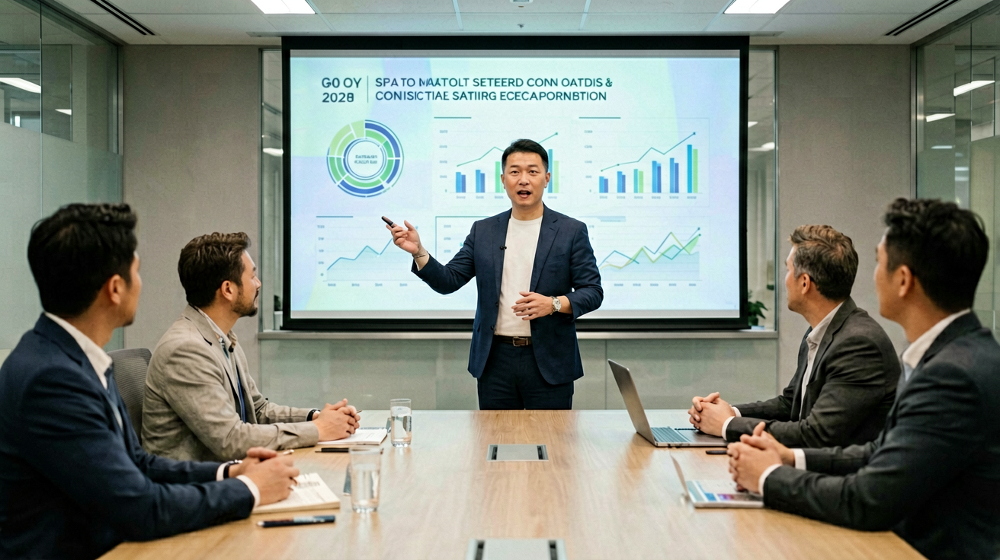

# AI 融资半年 3076.82 亿——从「金字塔顶端 30 家」到「1600 家机构入场」，中国 AI 资本地形图重画

> 2026年7月4日 | AI News Daily

---

## 一句话先说结论

**2026 上半年中国一级市场 AI 融资总额 3076.82 亿元，同比激增 148%——单单大模型、机器人、AI 芯片三条线合计吃掉 62% 份额，1600 家投资机构下场——中国 AI 资本市场的地形，已经从「TOP 30 独占」变成了「金字塔顶端 30 家 + 中间腰部 200 家 + 底部长尾 1000 家」的三层结构。**

---

## 一份 7 月 3 日的数据

2026 年 7 月 3 日下午，IT 桔子发布《2026 上半年中国新经济投融资报告 · AI 篇》，把 H1 一级市场的 AI 投资盘点做了完整刷新。核心数据摆到桌面上：

- **上半年 AI 领域融资总额 3076.82 亿元**，同比 2025 H1 的 1240 亿元，激增 **148%**。
- **披露融资事件 1284 起**，同比增长 62%，事件数增速远慢于金额增速——**说明单笔金额显著变大**。
- **中位数融资额 1.2 亿元**，同比翻倍；平均融资额 2.4 亿元，同比增长 92%。
- **参与投资机构 1600 家**，创历年新高——2025 H1 是 980 家，2024 H1 是 620 家。
- **单笔超 10 亿元的融资 78 起**，占融资金额约 51%——**头部效应比 2025 更集中**。
- **TOP 20 融资项目合计吸金 1580 亿元**，占上半年总额 51.4%。

这几个数字放在一起，讲的其实是一件事——**AI 融资市场从 2023-2024 年的「少数明星项目吃走大盘」，进化到 2026 年的「金字塔顶端 + 腰部 + 长尾」三层并进**。这不是简单的「热度回归」，而是资本市场对 AI 产业分层认知的成熟。

---

## TOP 30 项目盘点：大模型 + 机器人 + 芯片三线角逐

从 IT 桔子公布的 H1 2026 TOP 30 融资项目名单看，钱主要流向三条主赛道——大模型基础设施、机器人本体、AI 芯片自主化。

**大模型基础设施赛道**吃走 TOP 30 的 12 席：
- **月之暗面**：3 月 C 轮 15 亿美元、5 月 D+ 轮 8 亿美元，2 次融资合计约 150 亿元
- **智谱 AI**：2 月 E 轮 40 亿元，估值突破 500 亿元
- **MiniMax**：4 月新一轮 30 亿元人民币
- **DeepSeek**：极少对外融资，据 The Information 7 月 3 日消息，深度求索接受了字节 60 亿元战略投资
- **阶跃星辰**：3 月 D 轮 20 亿元
- **零一万物**：1 月新一轮 10 亿元
- **面壁智能、百川智能、Nabla、日日新（商汤）** 等各有 5-15 亿元规模融资

**机器人赛道**吃走 TOP 30 的 8 席：
- **宇树科技**：3 月 F 轮 20 亿元，估值 550 亿元
- **智元机器人**：4 月 C 轮 20 亿元，估值 400 亿元
- **银河通用**：2 月 B++ 轮 10 亿元
- **星动纪元**：5 月 B 轮 12 亿元
- **松延动力**、**傅利叶智能**、**逐际动力**、**加速进化** 各 5-10 亿元规模

**AI 芯片赛道**吃走 TOP 30 的 6 席：
- **摩尔线程**：2 月 D++ 轮 40 亿元
- **壁仞科技**：4 月新一轮 25 亿元
- **燧原科技**：5 月新一轮 20 亿元
- **芯原微、后摩智能、爱芯元智**：各 5-15 亿元规模

TOP 30 还有 4 个「跨赛道」项目——**可灵 AI（快手 30 亿美元战略融资）、地平线（新一轮车载 AI）、Together AI 中国关联体、以及英矽智能（AI 制药 + BD 里程碑）**。三线合计占 TOP 30 融资金额约 82%，产业分工已经异常清晰。

---

## 数字盘点：一张表看清 2026 上半年 AI 融资

- **总额 3076.82 亿元**（同比 +148%）——历史最高半年记录
- **事件数 1284 起**（同比 +62%）——增速温和
- **单笔中位数 1.2 亿元**——同比翻倍，融资规模显著上移
- **10 亿元+ 融资 78 起**——占总金额约 51%，头部集中度提升
- **TOP 20 项目合计 1580 亿元**——占上半年总额 51.4%
- **参与机构 1600 家**——2025 H1 是 980 家，2024 H1 是 620 家
- **地域分布**：北京 891 亿元（29%）、上海 634 亿元（20.6%）、深圳 511 亿元（16.6%）、杭州 391 亿元（12.7%）、苏州+南京 218 亿元、其他地区 431 亿元
- **产业主线份额**：大模型 34%（约 1046 亿元）、机器人 17%（约 523 亿元）、AI 芯片 11%（约 338 亿元）、AI+应用（含医疗/教育/金融/制造）19%（约 585 亿元）、AI+芯片外的算力基础设施 8%（约 246 亿元）、其他 11%

---

## 三层结构：金字塔顶、中间腰部、长尾各在演什么

2026 上半年 AI 融资市场最值得留意的变化，不是「金额涨了」这件事，而是「资金分布形态」的转变。回看 2023-2024 年，AI 融资高度集中——**当时 TOP 10 项目吃走全市场 60%+ 的金额，中间腰部几乎没有钱**。到了 2026 上半年，这个格局第一次被打破，市场分层演化成三段。

**金字塔顶端 30 家：估值 200 亿-1000 亿+，以「基础设施 + 主赛道头部」为主。** 这些公司每次融资 10 亿-60 亿元起，估值以美元计。这一层的融资逻辑是「战略布局」——投资方不是为了短期回报，而是为了绑定 AI 时代最重要的入口/底座。参与方以字节、腾讯、阿里、美团这样的战略投资者，加上红杉、高瓴、启明、云锋这样的一线 VC 为主。

**中间腰部 200 家：估值 20 亿-200 亿，以「垂直大模型 + 明确场景应用」为主。** 单次融资 1 亿-10 亿元。腰部项目的融资逻辑是「产业分工」——每一家聚焦某一条垂直赛道（AI+医疗、AI+法律、AI+金融、AI+制造、AI+具身智能子领域），有清晰的收入模型和场景验证。参与机构以专业 VC + CVC + 地方国资平台为主，机构类型开始多元。

**底部长尾 1000+ 家：估值 1 亿-20 亿，以「初创+种子/天使」为主。** 单次融资 500 万-1 亿元。这一层的融资逻辑是「广撒网」——绝大多数公司会在 3-5 年内被淘汰，但只要跑出 1-2 家新独角兽，回报就足够覆盖整个组合。这一层的参与机构最多元——包括 AI 领域细分 VC、天使投资人、加速器、政府引导基金。

**这三层同时活跃**，是 2026 上半年最值得记录的变化。此前几年，中国 VC 圈只有「金字塔顶」是热的，中间腰部和底部长尾都在低迷状态。三层同时启动，说明市场对 AI 的认知已经从「明星项目狂欢」转变为「产业化分层布局」。

---

## 地域格局：北上深杭以外，成都、武汉、合肥追赶

一份 3076.82 亿元的资金地图，还讲了一个「区域再平衡」的故事。北上深杭仍然是绝对主场——合计吃走 78.9% 的金额。但如果拉长时间轴看，**北京份额从 2024 上半年的 41% 下降到 2026 上半年的 29%，上海从 24% 微升到 20.6%，深圳从 14% 上升到 16.6%，杭州从 8% 上升到 12.7%**——头部四城的份额在小幅重排，杭州与深圳明显上升。

**杭州上升的核心动因**是阿里通义系带动的一批阿里前员工创业，加上蚂蚁数科、支付宝 AI 应用、宇树科技、群核科技等杭州本地公司在 AI 领域的密集融资。**深圳上升的动因**则更多来自「AI + 硬件」的结合——从大疆背景的机器人团队、腾讯参投的 AI 芯片公司、到具身智能的深圳系创业者，深圳的产业链优势在 AI 时代继续放大。

北上深杭之外，**成都、武汉、合肥、西安、济南**开始出现零星 3-5 亿元规模的融资事件。这些城市不是「凭空冒出来的 AI 中心」，而是产业结构和高校资源的天然联动——成都有电子科技大学 + 芯片产业带、武汉有华中科大 + 光谷生态、合肥有中科大 + 半导体政策扶持、西安有西电 + 军工背景、济南有山大 + 山东省 AI 专项资金。地方引导基金 + 高校科研 + 产业基础三条线拧到一起，这些「二线科技城」的 AI 融资曲线在 2026 上半年出现明显上翘。

---

## 1600 家机构入场：资本结构在变化

**参与 AI 投资的机构数量从 2024 上半年 620 家、2025 上半年 980 家、涨到 2026 上半年 1600 家**——两年翻了 2.5 倍。这个数字背后，是资本结构的深度变化。

**变化一：地方国资平台大规模进场**。2026 上半年 AI 融资事件里，约 **35%** 有地方国资/引导基金参与——2024 上半年这个比例是 11%。地方国资入场的核心逻辑是「产业招商 + 财政激励 + 招才引智」——通过 AI 项目落地本地，同时匹配税收优惠和土地政策。上海国投先导、深圳南山战新投、杭州科创基金、苏州工业园区产投等成为 AI 领域最活跃的地方国资 LP。

**变化二：CVC（企业投资部门）密集出手**。字节、腾讯、阿里、美团、京东、快手、百度的 CVC 部门 2026 上半年在 AI 领域合计出手 210 次——同比翻倍。CVC 的投资逻辑区别于财务 VC——它们更看重「战略协同」（业务能不能接进自己的生态），而非「回报倍数」。

**变化三：外资美元基金相对减少**。相较 2024 上半年，2026 上半年参与 AI 融资的美元基金比例从 28% 下降到 12%。红杉、高瓴、启明的人民币主基金依然活跃，但纯美元通道明显收窄——中美 AI 政策脱钩背景下，这条趋势短期难以逆转。

**变化四：产业资本第一次系统性进场**。2026 上半年，宁德时代、比亚迪、格力、TCL、海尔、华为哈勃、小米长江产业基金等制造业头部企业的产业资本，在 AI 领域出手 148 次——是过去 3 年的总和。产业资本入场的核心动因是「AI + 制造」的融合红利——机器人本体、工业大模型、生产 AI 优化都是它们的关注方向。

---

## 大模型赛道内部：五强分化明显

大模型赛道在 TOP 30 项目里独占 12 席，但内部分化非常显著。可以粗略划成「三档」。

**第一档（第一梯队）**：DeepSeek + 月之暗面 + 智谱 AI + 阶跃星辰。这四家 2026 上半年融资金额合计约 400 亿元，估值全部站上 500 亿元人民币以上（DeepSeek 因为极少对外融资估值不透明，但业内共识是 800 亿+）。这一档的共同点是——**有明确的技术路线差异化**（DeepSeek 走开源+高性价比、月之暗面走长上下文、智谱走多模态+企业级、阶跃走多模态+推理）——不再是简单的「跟 OpenAI 做同一件事」。

**第二档（第二梯队）**：MiniMax + 面壁智能 + 百川智能 + 零一万物 + 商汤日日新。这一档 2026 上半年融资金额合计约 100 亿元，估值在 100 亿-300 亿元区间。第二档的共同挑战是——**技术差异化在缩小、商业化路径在收窄**——同时又要面对第一梯队的品牌+资源碾压，未来 12 个月的估值可能进一步分化。

**第三档（追赶者）**：Nabla（字节独立公司）、群核科技、启元世界、无问芯穹等。这一档融资金额相对小（合计 30-50 亿元），但胜在有明确的场景切入点或者股东背景（字节、腾讯）。

一个显著的判断是——**大模型基础模型公司的「五强格局」在 2026 上半年基本固化**。此后要挤进头部序列的窗口，正在快速关闭。这也是为什么 2026 下半年到 2027 上半年，可能会出现头部大模型公司的「上市潮」或「并购潮」——市场结构一旦固化，退出通道就成为下一个关键议题。

---

## 机器人赛道：从「本体」到「大脑」的分化

机器人赛道 2026 上半年吃走 17% 融资份额，是三条主赛道里增速最快的一条——同比翻了 3.5 倍。但机器人的钱不是撒到「所有机器人公司」，而是明显分化成两条子赛道。

**其一，具身智能本体**——宇树、智元、银河通用、星动纪元、松延、傅利叶、逐际、加速进化等。这条子赛道的核心是「机器人硬件本体」——足式、双足、轮式、多形态。融资逻辑是「谁能率先把成本打到 30 万元以内 + 稳定量产」。**宇树 F 轮 20 亿元、估值 550 亿元**，已经代表这个子赛道的头部水位。

**其二，具身智能大脑**——地平线的车载 AI、群核的空间智能、无问芯穹的算力协同、光轮智能的自动驾驶大模型。这条子赛道的核心是「机器人的中央控制系统 + 感知融合 + 规划决策」——更接近软件+算法+芯片的融合。融资逻辑是「谁能率先跑通端到端具身推理」。

两条子赛道未来 12 个月的关键观察是——**本体做得好但大脑跟不上，会被「大脑更强、本体差一档」的对手超越；反之亦然**。2026-2027 年会有一批本体公司选择开源自己的技术栈或者接受大脑公司的深度绑定——这是这个赛道下一波并购的核心逻辑。

---

## 对创业者的三条实战建议

**① 别只看「金字塔顶」——中间腰部与长尾同时活跃是 2026 下半年最大的融资窗口**。如果你的项目属于金字塔顶级技术路线（做基础大模型/做具身智能本体），确实竞争激烈——但如果你聚焦某个明确的垂直场景（AI+法律/AI+医疗/AI+工业质检），中间腰部资金正处于历史高位，是当前最容易拿到 1-5 亿元规模融资的窗口。

**② 地方国资 + 产业资本的组合，正在替代纯 VC 的融资通道**。过去大家谈融资只看红杉、高瓴、启明这些老牌 VC——2026 上半年 1600 家机构里，只有 300 家左右是纯 VC，剩下 1300 家是国资、CVC、产业资本、加速器、天使人。**你的融资故事需要为「非 VC 类型的资方」重新设计**——地方国资看什么、CVC 看什么、产业资本看什么——是三种截然不同的语言。

**③ 三线城市的 AI 融资曲线在上翘，是被低估的窗口期**。成都、武汉、合肥、西安、济南等城市，正在通过「地方引导基金 + 高校资源 + 产业招商政策」形成 AI 融资的第二梯队。如果你的项目落地成本能承受这些城市，融资难度可能远低于北上深杭。

---

## 对投资者的三条观察

**① 头部大模型「上市潮」可能在 2026 Q4-2027 Q2 出现**。月之暗面、智谱、MiniMax、阶跃星辰等公司的估值已经进入 200-500 亿元区间，一级市场的下一步是港股或美股上市。IPO 通道的打开可能是 2026 下半年整个 AI 赛道的重大情绪变量。

**② 机器人并购潮可能在 2026 Q4 提前到来**。本体与大脑的分化，加上 2026 上半年过热的估值，可能会催生本体公司之间、或者大脑公司收购本体公司的整合动作。10 家以上的机器人公司同时以 100+ 亿元估值融资，市场必然会通过并购来自然出清。

**③ AI 芯片赛道的政策变量比市场变量更大**。摩尔线程、壁仞、燧原融资额都在 20-40 亿元级别——但真正决定这个赛道估值的，不是财务模型，而是美国出口管制的下一步（是否把中国 AI 芯片进一步纳入制裁清单）。这是一条政策驱动的赛道，投资者需要把「政策情景」作为主变量而不是配变量。

---

## 对普通读者的三条含义

**① AI 融资的「地图颜色」在改变**。过去大家说到 AI，脑子里第一反应是北京中关村、上海张江、深圳南山——但 2026 上半年杭州、深圳的相对份额都在上升，成都、武汉、合肥、西安、济南也开始出现零星大额融资。**AI 不再是一线城市专属，二线科技城的机会窗口正在打开**。

**② AI 就业机会的分布也在变化**。资本流向哪里，人才需求就会集中在哪里。上半年参与投资的 1600 家机构，会在未来 6-12 个月推动被投企业招聘 10 万+ 岗位——最需要人才的赛道是**具身智能本体（机器人工程师）、AI 芯片验证（前端/后端设计）、大模型工程化（推理加速+多模态）、AI+行业垂直（医疗、法律、金融的领域专家）**。求职者可以按这条主线判断哪些赛道热度最高。

**③ AI 产品价格可能会继续下探**。3076.82 亿元的资金主要用途是「训练模型 + 建算力 + 补贴用户 + 抢市场」——市场化产品的价格在这样的资本注入下，短期内会继续保持竞争性下探。**2026 下半年到 2027 上半年，是普通用户享受 AI 产品补贴红利的黄金窗口**。

---

## 最后

AI 融资 3076.82 亿元，是一个很大的数字。但如果把它拆开看——**它由 1284 起事件、1600 家机构、五线城市的产业招商、三条主赛道的分工、三层市场结构共同拼出来**。这份数字的真实含义不是「AI 又火了」，而是「AI 融资市场进入了产业化分层布局的成熟期」。

**下一个 6 个月要看什么？**

- **头部大模型公司会不会出现第一个 IPO**——这是市场情绪的关键变量；
- **机器人赛道会不会出现第一起 100 亿元+ 并购**——这是本体与大脑分化的自然出清；
- **地方国资 + 产业资本组合会不会成为 AI 融资的新主导力量**——这是资本结构变化的下半场；
- **AI 芯片赛道会不会遭遇进一步的政策变量**——这是唯一还没有兑现的下行风险。

四个变量任何一个落地，都会明显改变下半年 AI 融资的方向。**但可以判断的是——2026 全年 AI 融资总额突破 6000 亿元，几乎已是定局**。这条曲线要走到哪里，我们下一份季度报再回看。

---

**AI News Daily · 每日 AI 深度内容 · 2026-07-04**
