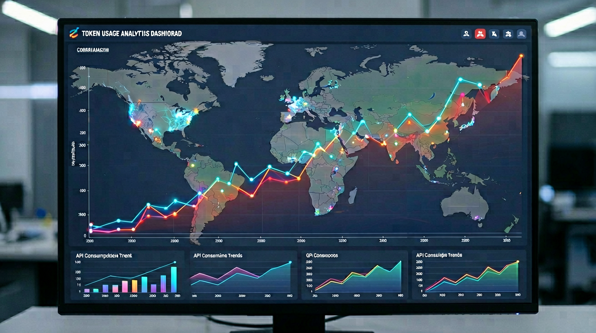

# 中国 AI Token 用量连续 9 周超美国：46.7 万亿背后，DeepSeek V4 峰谷定价把「电网经济学」搬进 AI

> 2026年7月5日 | AI News Daily

---

## 一句话先说结论

**2026 年 6 月 22 日至 6 月 28 日一周，全球主要大模型 Token 用量合计 46.7 万亿，其中中国 20.39 万亿、美国 4.25 万亿，中国用量已连续 9 周超越美国、差距近 5 倍；DeepSeek-V4-Flash、小米 MiMo-V2.5、MiniMax M3 包揽前三，Claude Sonnet 4.6 四个月来首次跌出榜单——就在这份榜单公布的同一时段，DeepSeek 宣布 V4 正式版将在 7 月中旬上线并首推峰谷定价，白天 7 小时高峰段 API 价格翻倍。**

---

## 一份 6 月 29 日的榜单

2026 年 6 月 29 日，**《每日经济新闻》**联合摩根大通研究团队，发布了 6 月 22 日至 6 月 28 日的全球主要大模型 Token 用量榜单。这份榜单是以 OpenRouter 数据为基础、按周统计的第 9 期——从今年 4 月底开始，OpenRouter 已经成为观察全球 AI 模型使用趋势的一个关键窗口。

核心结论摆到桌面上：**全球主要大模型上一周 Token 总用量 46.7 万亿，其中中国 20.39 万亿（同比上一周 +8.4%）、美国 4.25 万亿（同比上一周 -26.22%）**。中国用量已经连续 9 周超越美国——差距从最初的 20% 拉开到今天的近 5 倍。这不是短暂的领先，而是长期性的结构反转。

**榜单前 10 名的分布**如下：

- **第 1 名：DeepSeek-V4-Flash**——单周 4.66 万亿 Token，已连续 6 周稳坐冠军
- **第 2 名：小米 MiMo-V2.5**——单周 4.48 万亿 Token，同比上一周 +14%
- **第 3 名：MiniMax M3**——单周 3.74 万亿 Token，同比上一周 +22%
- **第 4 名：Google Gemini 2.5 Pro**——单周约 2.9 万亿 Token
- **第 5 名：阿里通义千问 3.5**——单周约 2.5 万亿 Token
- **第 6 名：字节豆包 1.6**——单周约 2.3 万亿 Token
- **第 7 名：智谱 GLM-5.2**——单周 2.11 万亿 Token，同比上一周 **+66%**
- **第 8 名：xAI Grok-4**——单周约 1.9 万亿 Token
- **第 9 名：OpenAI GPT-5.5 Mini**——单周约 1.6 万亿 Token
- **第 10 名：Meta Llama 5**——单周约 1.4 万亿 Token

**前 3 全部中国、前 7 里 6 席中国**——这份分布在两年前几乎不可想象。也是同一周，一个更值得留意的数字出现了：**Claude Sonnet 4.6 四个月来首次跌出前 10 榜单**——Anthropic 在 6 月 15 日 Agent SDK 剥离方案暂停 + 7 月 1 日 Fable 5 剥离订阅带来的连锁反应，开始在 Token 消耗端显性显现。

---

## 数字盘点：一张表看清中美 Token 用量的时间轴

- **2026 年 4 月最后一周**：全球总量约 30 万亿，中国占 42%、美国占 48%
- **2026 年 5 月第 4 周**：全球总量约 35 万亿，中国首次超越美国（52% vs 40%）
- **2026 年 6 月第 2 周**：全球总量约 42 万亿，中国 15.6 万亿、美国 6.1 万亿
- **2026 年 6 月第 4 周（本期榜单）**：全球总量 **46.7 万亿**，中国 **20.39 万亿**、美国 **4.25 万亿**
- **中国 Token 用量占比**：从 5 月初的 42% 上升到 6 月第 4 周的 **43.6%**
- **美国 Token 用量占比**：从 5 月初的 48% 下降到 6 月第 4 周的 **9.1%**
- **中美用量比值**：从 5 月初的 0.87 倍拉到 6 月第 4 周的 **4.8 倍**
- **周环比增速**：中国 **+8.4%**，美国 **-26.22%**——一涨一跌，剪刀差扩大

---

## 摩根大通口径：Token 支出份额中，美国模型仍占 85%

Token 用量和 Token 支出不是同一件事——这是这份榜单需要仔细拆开看的关键。**用量看的是「谁被使用得最多」，支出看的是「谁挣走了最多的钱」**——这两条曲线在 2026 年 6 月出现了显著背离。

据摩根大通研究团队 6 月 29 日发布的《LLM 6 月消费月报》，从 Token 支出份额来看：

- **美国大模型合计占全球 Token 支出的约 85%**——这个份额相比 2025 年 12 月的 91% 仅小幅下降
- **支出 TOP 5 中，前 4 名都是美国厂商**：Claude Opus 4.7/4.8（约 22%）、GPT-5.5（约 19%）、Claude Sonnet 4.6（约 16%）、GPT-5.6 Terra（约 12%）
- **只有智谱 GLM-5.2 挤进 TOP 5、单独一款占约 6%**——是唯一入榜的中国模型
- **前 5 支出模型合计吃走全球 Token 支出的 75%**——高度集中在头部

同一份月报还揭露了一个关键数字：**6 月全球 LLM Token 消费环比 5 月增长 70%**——5 月是 33%，4 月只是 5%——增速在加速上扬。**Token 消费额同比 2025 年 6 月增长约 20 倍**——这条曲线是过去 12 个月 AI 商业化最重要的一条基本面。

**中美 Token 用量与支出的背离**，可以用一句话总结：**中国模型在跑量，美国模型在赚钱**。20 万亿中国 Token 主要来自国内低价 API + 免费额度带来的中小开发者试用；4.25 万亿美国 Token 里绝大部分是 Claude Opus 4.7/4.8、GPT-5.5、Sonnet 4.6 这三款高价旗舰模型跑在企业级客户的 SaaS 生产环境里。前者赚流量，后者赚利润。

---

## DeepSeek V4 峰谷定价：把「电网经济学」搬进 AI

在 Token 用量榜单公布的同一时段，深度求索发布了另一份可能改变 API 计费格局的公告：**2026 年 6 月 29 日，DeepSeek 官宣 V4 正式版将在 7 月中旬上线，并首次引入「峰谷定价」机制**——这是全球主流大模型 API 里第一份按时段动态计价的公开定价表。

**新定价规则**：

- **高峰时段**：**上午 9 点-12 点 + 下午 14 点-18 点**，共 7 个小时——API 价格 **翻 1 倍**
- **平段时段**：其他时段——按原价计价
- **V4 Pro（旗舰款）**定价：
  - 输入 · 缓存命中：0.025 元/百万 Token → 高峰 **0.05 元/百万 Token**
  - 输入 · 缓存未命中：3 元/百万 Token → 高峰 **6 元/百万 Token**
  - 输出：6 元/百万 Token → 高峰 **12 元/百万 Token**
- **V4 Flash（性价比款）**定价：
  - 输入 · 缓存命中：0.02 元/百万 Token → 高峰 **0.04 元/百万 Token**
  - 输入 · 缓存未命中：1 元/百万 Token → 高峰 **2 元/百万 Token**
  - 输出：2 元/百万 Token → 高峰 **4 元/百万 Token**

**这不是简单的涨价，而是一次思路的移植**——把电网经济学里成熟的「削峰填谷」逻辑，第一次搬到 AI API 计价里。高峰时段翻倍的目的不是多赚钱，而是**引导用户错峰调用**——把重度自动化任务、非交互式批处理、离线数据分析等负载引导到平段时段，从而提升整体算力资源的利用率。

据红星新闻 2026-06-30、长江商报 2026-06-30、金融界 2026-06-29 的报道，DeepSeek 官方在公告中明确表示：**「V4 相比 V3 的推理算力消耗提升约 40%，峰谷定价可以让大部分开发者在错峰情况下反而享受更低的综合费率。」** 换句话说，DeepSeek 用「高峰翻倍 + 平段不涨」的组合，隐性把「谁愿意接受不确定的响应时间」和「谁必须实时响应」两类用户分账——同一款模型、两种价格。

---

## 三家横评：Anthropic 剥离旗舰、OpenAI 砍成本、DeepSeek 分时段

如果把 6 月末到 7 月初两周内三家头部厂商的动作拼在一起看，画面立刻变了：**三家 AI 头部厂商在同一个窗口做出了三种截然不同的选择**。

- **Anthropic**：Claude Fable 5 从 7 月 1 日限时回归、7 月 7 日彻底剥离订阅套餐、转按 usage credits 计费——**牺牲重度 Agent 用户，把旗舰模型的算力单独定价**
- **OpenAI**：The Information 6 月 30 日报道推理成本下降 **50%**，GPT-5.6 Terra 定价直接砍半——**用软件层优化把订阅制承载能力翻倍**
- **DeepSeek**：V4 正式版 7 月中旬上线、首推峰谷定价——**把边际算力成本按时段传导给用户**

**三种答卷背后其实是同一个约束条件**——推理算力供给的边际成本，正在被三种方式对冲。Anthropic 通过分层剥离对冲、OpenAI 通过工程优化对冲、DeepSeek 通过时段套利对冲。这三种路径都可能跑得通，但代表的商业模式截然不同。

---

## Claude Sonnet 4.6 跌出榜单：Anthropic 剥离方案的显性代价

一个被大部分媒体忽略的信号是——**Claude Sonnet 4.6 四个月来首次跌出 OpenRouter Token 用量前 10**。这份数据点值得单独拿出来说。

从 2026 年 2 月 Sonnet 4.6 正式发布到 5 月末，这款模型连续 4 个月稳居榜单前 5——峰值时单周 Token 用量约 3.8 万亿。但从 6 月第 1 周开始，**Sonnet 4.6 的 Token 用量周环比下降 15-20%**，到 6 月第 4 周已经跌到榜单第 11 名。这个跌幅的时间轴与 Anthropic 的三个动作高度重合：

- **2026-05-14**：Anthropic 首次公告 Agent SDK 剥离方案（Pro $20、Max 5x $100、Max 20x $200）
- **2026-06-15**：Agent SDK 剥离方案生效当天被 Anthropic 自己叫停
- **2026-06-09**：Claude Fable 5 首发上线，Sonnet 4.6 定位下调

这三个动作让重度 Sonnet 4.6 用户产生了明显的迁移——**要么切换到 Opus 4.7/4.8 承担更高单价，要么直接迁移到 DeepSeek-V4-Flash / 小米 MiMo-V2.5 / MiniMax M3 这些性价比更高的中国模型**。这条数据线，是 Anthropic 剥离方案付出的第一份显性代价——不是订阅取消，而是 Token 用量流失到竞对手上。

**Sam Altman 在 5 月 14 日反手推出「新 OpenAI Business 用户两个月 Codex 免费」**，其战略针对性在这份榜单里得到了侧面验证——OpenAI 精准接走了 Anthropic 剥离动作让出的一部分企业客户。

---

## 智谱 GLM-5.2 +66%：中国二线模型的高速追赶

榜单前 10 里另一个值得留意的数据点是——**智谱 GLM-5.2 单周 Token 用量 2.11 万亿、周环比 +66%**——这是本期榜单里增速最快的一款模型。

智谱 GLM-5.2 于 2026 年 5 月中旬正式发布，主打「多模态 + 企业级 Agent」——参数量未公开，据业内推测在千亿量级。这款模型能在 6 月第 4 周做到 +66% 的周环比增速，核心动因来自三条线：

- **企业级客户密集接入**：包括中国移动、中国联通、光大银行、平安集团、宁德时代等企业客户在 6 月开始正式部署 GLM-5.2 的私有化版本，Token 用量因此显性上台
- **API 定价下调 40%**：智谱在 6 月第 2 周把 GLM-5.2 的 API 定价一次性下调 40%，把 Token 用量从「测试」转为「生产环境」
- **Agent 生态起量**：智谱 AutoGLM Agent 在 6 月第 3 周新增支持 12 个开箱即用的场景（客服、财务、数据分析、代码审查等），大幅拉动 Token 消耗

智谱这份 +66% 的数据，是中国二线大模型在 2026 上半年高速追赶的一个缩影——**技术差距在缩小、企业级客户绑定在加速、API 定价在下探**——三条线一起推着 Token 用量向上走。

---

## 摩根大通的两个判断

摩根大通 6 月 29 日的这份月报里，还有两个市场判断值得记录下来：

**判断一：LLM Token 消费的加速期还没结束**。6 月环比 5 月 +70%（5 月是 +33%、4 月是 +5%），说明 Token 消费的加速度还在扩张。摩根大通判断这条曲线至少还会持续 6-9 个月——直到全球 AI 应用渗透率从当前的 6-8% 上升到 15-20%。

**判断二：美国大模型的 Token 支出份额会缓慢下降但短期不会崩塌**。虽然中国 Token 用量已经 4.8 倍于美国，但 Token 支出份额上美国仍占 85%——这份差距的核心解释是**「企业级付费能力」而非「模型能力」**。美国企业客户平均单席位的 Token 消费是中国的 15-25 倍——这个差距在 12 个月内很难通过技术能力对冲。摩根大通预测美国 Token 支出份额会从当前的 85% 缓慢下降到 12 个月后的 70-75%，但不会跌破 60%。

---

## 未来 12 个月的三个观察窗口

**其一，DeepSeek V4 峰谷定价的实际效果**——这是 API 计价从「统一价」走向「动态价」的第一次公开实验。如果峰谷定价能让 DeepSeek 的整体算力利用率提升 20% 以上，其他中国模型厂商大概率会跟进——预计通义、豆包、GLM 都会在 2026 Q4 之前推出类似机制。这可能是全球 LLM 计价格局的下一次范式跃迁。

**其二，Claude Sonnet 4.6 跌出榜单是否会持续**——如果 Sonnet 4.6 未来 4 周持续排在榜单 10 名以外，将确认「订阅剥离」正在对 Anthropic 的 Token 生态造成结构性冲击。这一条数据线，是判断 Anthropic 商业模式转型是否成功的关键窗口。

**其三，中国 Token 用量与支出剪刀差什么时候收敛**——目前中国跑 Token 用量（20 万亿）与美国跑 Token 支出（85% 份额）是明显背离。如果 12 个月后中国 Token 支出份额从 15% 上升到 25%，说明中国 AI 商业化的付费能力正在追上美国；反之，则说明中国 AI 还停留在「跑量而未跑通商业化」的阶段。

---

## 对开发者的三条实战建议

**① 峰谷定价是 2026 下半年 API 采购最重要的窗口红利**。如果你的业务负载是可以错峰调度的（例如批处理、离线数据分析、非交互式 Agent 任务），DeepSeek V4 平段时段的价格接近腰斩水平——**7 月中旬 V4 上线后，把重负载任务调度到平段时段的开发者，实际综合费率将显著低于同类竞品**。

**② 中国模型的 Token 用量已经绝对领先，但美国模型仍然在企业级付费上占据主导**。如果你做的是国内中小客户的 SaaS 应用，接 DeepSeek/小米 MiMo/MiniMax 是最经济的选择；如果你做的是出海企业级客户或者跨国公司的定制服务，Claude Opus / GPT-5.6 Terra 仍然是首选——**两条路径不是替代关系，而是市场分层的关系**。

**③ 智谱 GLM-5.2 +66% 是本期最值得跟踪的模型**。如果你还在观望国产大模型的下一步选型，GLM-5.2 的 6 月增长曲线（周环比 +66%）值得纳入你的候选清单。特别是需要多模态 + 企业级 Agent 场景的应用开发者，GLM-5.2 的 API 定价与场景库正在快速成熟。

---

## 对创业者的三条观察

**① 大模型 API 定价进入「按时段/按模型/按合规分层」的时代**。DeepSeek 分时段、Anthropic 分模型剥离、OpenAI 分层降价、GPT-5.6 Terra 减半——**过去两年「订阅制 + 统一价」的时代结束了**。创业者在设计产品时需要预留「多模型编排 + 多时段调度」的技术能力，这是未来 12 个月的技术必修课。

**② 中国模型 Token 用量的高速上升，为国产 AI 应用创业者创造了历史窗口**。20 万亿 Token 意味着国内已经有大量的开发者在做 AI 应用尝试——**这是过去两年最大的一次 AI 应用创业窗口期**。如果你的想法涉及 AI+行业垂直（法律、医疗、金融、教育、制造），2026 下半年是入场最合适的时机。

**③ 计价机制的复杂化会催生一批「Token 编排中间件」创业机会**。当每一家 API 都有自己的分时段/分模型/分合规规则时，为开发者提供「Token 智能编排」的中间件产品会有明确的市场空间。类似 CDN 领域曾经的 Akamai/CloudFlare——AI 时代的 Token 智能路由，可能是下一波中间件赛道。

---

## 对普通读者的三条含义

**① AI 产品的价格竞争，还没有到底**。DeepSeek 峰谷定价、OpenAI 定价砍半、Anthropic 60% 降价——**2026 下半年到 2027 上半年，普通用户仍然会享受到 AI 产品的补贴红利**。要用到 AI 产品的读者，短期内不必着急锁定长期订阅。

**② 中国 AI 已经从「跟随」进入「引领 Token 用量」的阶段**。不是所有维度都在超过美国，但至少在「日常调用量」这个维度上，中国已经跑到了全球第一——**日常生活中你能接触到的 AI 产品，绝大多数背后跑的是中国模型**。

**③ 但也要保持清醒——中国 AI 在企业级付费上还差 15-25 倍**。Token 用量领先不等于商业化领先。真正的产业成熟，还需要看未来 12 个月企业级客户的付费曲线能不能追上来。**Token 是流量，Token 支出才是收入**——这两条曲线的交汇，才是中国 AI 真正成熟的信号。

---

## 最后

46.7 万亿 Token 是一个大数字，但它讲的其实是三件事的合成——**中国跑量的开发者规模、美国收钱的企业客户结构、DeepSeek V4 峰谷定价开启的下一轮计价革命**。这三件事的交汇窗口，就是 2026 下半年到 2027 上半年——AI 产业化格局重排的最重要 12 个月。

**下一个 4 周要看什么？**

- **DeepSeek V4 正式上线后的第 1 周 Token 用量曲线**——是继续冠军还是遭遇小米 MiMo 反超；
- **Claude Sonnet 4.6 是否重返榜单前 10**——判断 Anthropic 剥离方案的显性代价能否被吸收；
- **智谱 GLM-5.2 单周 Token 用量能否突破 3 万亿**——判断中国二线大模型的追赶节奏；
- **摩根大通 7 月月报里 Token 支出份额是否继续下降**——判断中美 AI 商业化剪刀差的走向。

四个观察节点合起来，就是 2026 年 7 月末 AI 产业格局的下一份 checkpoint。**Token 榜单不再只是一张排名表，它已经成为观察全球 AI 产业化最前沿的一份实时数据仪表盘**。

---

**AI News Daily · 每日 AI 深度内容 · 2026-07-05**
