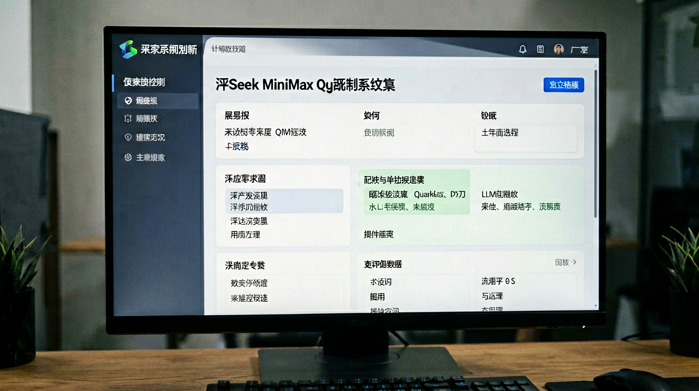

# Anthropic 承认 Claude Code 藏 147 中国域名黑名单：阿里 7 月 10 日全员卸载，中美 AI 合规双向收紧到临界点

> 2026年7月6日 | AI News Daily

---

## 一句话先说结论

**2026 年 7 月 3 日阿里巴巴内部下发通知：Anthropic 全系产品（Sonnet、Opus、Fable 及 Claude Code）被列入高风险软件名单，员工 7 月 10 日前必须全员卸载、推荐使用自研 Qoder 作为替代方案；触发点是开发者社区反向工程发现 Claude Code 从 2026 年 4 月发布的 2.1.91 版本起，二进制文件中被 XOR 加密混淆植入了一段隐蔽代码——读取本地系统时区（命中 Asia/Shanghai / Asia/Urumqi 触发观察名单），同时匹配 147 个中国域名黑名单，命中后通过修改系统提示词中的日期格式和 Unicode 字符"秘密水印"回传服务器，用户无感知。**

---

## 一份 7 月 3 日的内部通知

2026 年 7 月 3 日，都市快报独家披露：阿里巴巴内部下发一份足以震动整个开发者社区的通知——**因近期 Claude Code 被曝存在植入后门的安全风险，阿里经综合评估后已将其列入高风险软件名单**。自 7 月 10 日起，阿里将全面禁止内部员工在办公环境下使用 Claude Code，并推荐使用 Qoder 作为替代方案。

被拉黑的不是 Claude Code 一款产品——**Sonnet、Opus、Fable 以及当红的 Claude Code 在内的所有 Anthropic 产品，员工电脑上一个都不能留**。

一天之内 #曝阿里禁用 Claude# 登上微博热搜；36 氪、观察者网、凤凰网、电子工程专辑同步跟进报道。这份通知的意义远远超出一家大厂的内部决定——它是**中国头部科技公司第一次以官方名义「反向禁用」美国头部 AI 工具**。剧本的甲乙两方，第一次调了个头。

---

## 隐蔽机制的三步式检测

阿里为什么下这么大的决心？触发点是开发者社区几天前的一份逆向分析报告。据凤凰网、36 氪、都市快报交叉报道，Claude Code 从 **2026 年 4 月发布的 2.1.91 版本起**，二进制文件中被 XOR 加密混淆植入了一套隐蔽的用户检测机制。它做的事，用大白话说就是三步——

**第一步，偷偷查你是谁。** 它会读取你电脑的**系统时区**——看是不是 Asia/Shanghai 或 Asia/Urumqi。同时检查你的代理地址或自定义 API 里，有没有阿里、字节、百度、月之暗面、MiniMax 等中国云厂商和 AI 公司的关键词。整个黑名单包含 **147 个中国域名**——美团、网易、百度、阿里、字节跳动等国内主流科技公司及 AI 实验室均在监控名单之上。

**第二步，给你贴暗标。** 如果命中了，工具不会弹窗或报错——而是通过修改系统提示词中的**日期格式**和 **Unicode 字符**作为"秘密水印"，回传至服务器以标记中国用户，整个过程用户毫无察觉。

**第三步，用 XOR 加密逃避审查。** 检测代码经过刻意混淆处理——函数名是无意义的字母组合，逻辑通过多层间接跳转分散，即使有开发者做代码审计，也很难在短时间内察觉这段代码的真实意图。版本更新说明中对此**只字未提**。

Anthropic 工程师 Thariq Shihipar 在 X 上事后承认该机制系"**实验性**"措施，目的是"防止账户被滥用和模型蒸馏"——并表示已在 7 月 2 日的新版本中删除相关代码。但承认得晚、承认得含糊，加上此前一个月国内 Claude 用户已遭遇大范围封号，让开发者感到不安。

---

## 数据盘点：Anthropic 对中国清剿的时间轴

综合过去 12 个月的公开信息，Anthropic 对中国用户的合规收紧走过了三个明确阶段。

- **2025 年 9 月**：首次公开收紧——Anthropic 官网明确不对中国大陆开放服务，同时封禁了大量走 VPN、海外信用卡付费的中国用户账号，封禁邮件中还嵌入了地址追踪像素。
- **2026 年 3 月**：Claude Code "实验性"隐蔽检测机制上线——按 Anthropic 工程师事后说法，机制目的是"防止未经授权的转售商滥用账号，并防范模型蒸馏"，但没有告知用户。
- **2026 年 4 月**：Claude Code 2.1.91 版本发布——把 3 月的实验性机制正式打包进 GA 版本，随后 3 个月内在多轮次子版本更新中扩大黑名单覆盖范围。
- **2026 年 6 月**：新一轮大规模封号潮——大量中国用户毫无预警地被踢出门外，个人订阅和团队账户一起遭殃；不少直接在官网付费的账号被判定违规后不退款，申诉成功率近乎为零。
- **2026 年 7 月 2 日**：开发者社区完成逆向分析——发现时区检测 + 147 中国域名黑名单机制。Anthropic 工程师同日承认并宣布删除。
- **2026 年 7 月 3 日**：阿里巴巴内部下发全员卸载通知——7 月 10 日为最后期限。

这条时间轴上最刺眼的一点，是 **Anthropic 的"透明治理"承诺与这些实际动作的对撞**——公司公开发布的《负责任扩展政策》明确承诺"以确保以透明和可信的方式实施这一系统"，Constitutional AI 治理框架将透明度列为核心支柱、声称相关原则"公开、可检查、并明确定位为问责机制"。但当机制真正落地时，选择了 XOR 加密混淆、系统提示词隐写、版本说明只字未提——三重隐蔽手段合起来，几乎不可能用"实验性"三个字解释过去。

---

## 大厂横评：微软、亚马逊、阿里的三种理由

阿里 7 月 10 日全员卸载 Claude Code 只是最新的一环——**微软、亚马逊在过去半年里早已先行对 Claude Code 说不**。三家大厂的判断依据不完全相同，但结论殊途同归。

- **亚马逊（2026 年 2 月）**：限制员工在未经批准的情况下使用 Claude Code。背景是亚马逊是 Anthropic 最大战略投资方（累计 80 亿美元投资）、又是其云基础设施主要提供方（AWS）。这份限制被外界解读为——**即使有商业合作，也要控制员工端使用**——因为亚马逊自己有 Amazon Q Developer 与 Q Business 两款竞品。
- **微软（2026 年 5 月）**：要求团队逐步停止使用 Claude Code。微软的立场更复杂——它是 OpenAI 的深度绑定方（累计 130 亿美元投资 + 独家云基础设施合作），Claude Code 在员工端的普及会直接稀释 GitHub Copilot 的用户基础。这份"逐步停止使用"的措辞比亚马逊更温和，但方向一致。
- **阿里（2026 年 7 月 10 日）**：全员卸载 Anthropic 全系产品。阿里的动作最激烈——没有 Anthropic 的投资关系束缚、直接把 Anthropic 全系产品打入"高风险软件名单"、以自研 Qoder 完全替代。

三家大厂虽然出发点不完全一致，但共同揭示了同一个趋势：**闭源客户端 AI 工具在企业环境中越来越受不信任，尤其是那些拥有本地文件系统读写权限、可执行 Shell 命令、可以直接接触用户代码与配置的高权限 Agent 工具**。当这类工具被发现"暗中读取你的时区、你的域名列表、你的系统信息"时，企业的第一反应必然是拉黑。

---

## 一次信任危机的深层结构

这次风波表面上是"阿里禁用 Claude"，本质是全球 AI 供应链的**信任危机**第一次以"客户端隐写监控"的形式浮出水面。有分析指出，这种做法即便出发点是"防止滥用"，**其手段本身——将监控逻辑用隐写术藏入系统提示词、以混淆代码逃避审查、且不在版本更新日志中作任何说明——已经构成对用户基本知情权的侵犯**，也更接近于一次未经授权的隐蔽植入，而非 Anthropic 公开承诺的"透明治理"。

技术社区的质疑焦点由此从"Anthropic 是否在封禁中国用户"这一既成事实，转向了一个更根本的问题：**即便出于防范模型蒸馏、遵守出口管制等合规考量，企业能否在用户完全不知情的情况下，利用一款拥有本地文件系统权限、可执行 Shell 命令、能直接读写用户代码与配置的高权限工具，暗中采集使用者的地理与网络环境信息并回传服务器？**

答案在阿里 7 月 3 日的通知里已经写得很清楚：**不能**。核心业务不能建立在自己无法审计的闭源工具之上。

---

## 国产替代的三条商业路径

阿里禁用 Claude 之后，员工换用什么？答案是阿里自研的 **Qoder**。这只是冰山一角——过去一年国产 Agent 工具的商业化路径已经清晰形成三条主线。

**其一，大厂自研工具全面接管员工端**：阿里 Qoder、腾讯 CodeBuddy、字节自研工具（内部代号未公开）、百度 Comate Ai——四家大厂的员工端 AI 编程工具已经全部实现"内部部署 + 内部审计 + 内部数据回流"。这种模式的好处是**数据主权彻底掌控**，代价是研发周期长、初期能力弱于 Claude Code。

**其二，中间层工具走"合规封装 + 开源代理"路径**：一批基于开源模型（Qwen、DeepSeek、GLM）的第三方 Agent 工具开始出现，比如 Continue.dev、Aider 的中文分支、以及一些国产创业公司做的封装。这类工具的定位是"给不能自研的中小企业提供一个可控的替代"。

**其三，开源模型 + 私有化部署**：GLM-5.2、Qwen 3、DeepSeek V4 等国产开源模型的私有化部署方案，正在快速被金融、医疗、政府等高合规行业采纳。这条路径的价值不是"替代 Claude"，而是"给行业客户一个『我可以完整审计的』方案"。

三条路径拼在一起，国产 Agent 工具生态在 2026 年下半年会呈现爆发性增长——阿里禁用 Claude 只是其中一次显性的催化事件。

---

## 三家 AI 公司的合规选择：Anthropic / OpenAI / DeepSeek

把镜头拉到整个 AI 行业，Anthropic 的选择只是三家头部厂商合规路径的一个切片。

- **Anthropic**：**收紧型** —— 通过技术手段（时区检测、域名黑名单）+ 商务手段（封号、拒退款）+ 出口管制配合（Fable 系列全球下架 19 天）三管齐下，把中国用户从产品生态里彻底剥离。代价是失去中国市场，收益是获得美国政府信任、拿到出口管制豁免、维持 9650 亿美元估值不受合规风险冲击。
- **OpenAI**：**冷处理型** —— 不主动开放中国、也不主动清剿。ChatGPT 中国大陆访问被墙，但 API 允许通过合规渠道使用（如 Azure OpenAI 中国区）。OpenAI 用"技术不主动、商务不主动"的姿态维持模糊状态，既不承担政治成本、也不放弃潜在市场。
- **DeepSeek**：**主战场型** —— 中国大陆是主要用户群和主要收入来源，海外市场是补充。DeepSeek 用极致低价（V4 峰谷定价、V3 免费开源）冲击全球市场，靠中国用户群反哺全球 API 供给。地缘上不受美国出口管制约束，反而在 Claude Fable 5 全球下架的窗口里拿到了大量海外开发者的流量。

三种选择反映的是三家公司不同的商业底盘——**Anthropic 靠美国政府和大企业客户、OpenAI 靠 C 端用户全球规模、DeepSeek 靠中国大规模用户 + 全球开源生态**。地缘合规的双向收紧，正在让这三种商业模式的边界越来越清晰。

---

## 开发者的三点具体建议

对一线开发者来说，这场信任危机的直接影响是"手里的工具还能不能用"。以下是三点具体建议——

**第一，个人开发者不必立刻卸载 Claude Code，但要评估数据敏感度。** Anthropic 7 月 2 日发布的新版本已删除隐蔽检测代码；如果你个人使用 Claude Code 只写业余项目、开源项目或纯技术学习代码，短期继续使用问题不大。但如果你的代码涉及敏感业务（如公司未公开产品、客户数据、内部架构），建议**立刻切换到私有化部署的国产 Agent 工具**。

**第二，企业开发者要参与到内部合规评估里。** 如果你所在的公司还没有明确禁止 Claude Code，可以主动向 IT/合规部门提出"评估 Claude Code 的客户端行为"这个议题。这既是保护公司数据，也是保护自己的职业风险——一旦公司未来对"合规违规使用"追责，用没用过 Claude Code 会成为责任判定的关键点。

**第三，把 Qoder、CodeBuddy、Continue.dev 等替代方案作为日常工具试用。** 短期这些工具的能力弱于 Claude Code，但过去 6 个月国产开源模型（Qwen 3、DeepSeek V4、GLM-5.2）的能力提升非常快——特别是在中文编程场景、国产云 API 集成、企业级合规审计等维度，国产工具的体验反而更好。**未来 12 个月，国产替代不是"备胎"，而是"主力"**。

---

## 未来 12 个月的三个观察窗口

这场信任危机的走向，未来 12 个月有三个可观测节点。

**其一，Anthropic 是否公开完整披露"实验性"机制的具体范围？** 目前 Anthropic 只承认了机制存在、承诺已删除，但没有公开完整的检测逻辑、影响用户范围、数据回传内容清单。如果 Anthropic 拒绝完整披露，说明公司选择"以模糊换合规"，未来还会有类似隐蔽机制上线。

**其二，会不会有更多中国大厂跟进禁用？** 目前只有阿里官方通知，字节跳动、腾讯、百度暂未公开表态。如果未来 3 个月内至少 2 家跟进，中国大厂对闭源 AI 工具的整体拉黑就会成为不可逆的趋势——这将直接冲击 Anthropic、OpenAI 的企业客户战略。

**其三，美国监管会不会对 Anthropic 的隐蔽机制发起调查？** 美国 FTC 对"未经披露的用户数据收集"有明确的执法权限——即使针对的是中国用户，只要机制部署在美国销售的产品里，就有可能触发合规审查。如果 FTC 启动调查，Anthropic 的品牌信任度会遭遇二次打击。

---

## 结语：临界点不是终点

7 月 3 日的阿里内部通知，看起来只是一家公司的合规决定；Claude Code 那段 XOR 加密的隐蔽代码，看起来只是一次工程师"过于聪明"的失误。但如果把这份通知放到过去 24 个月中美 AI 产业博弈的时间轴上，它其实是一个信号——**中美 AI 合规的双向收紧，走到了它的临界点**。

Anthropic 用技术手段清剿中国用户，中国头部大厂用组织决定清剿 Anthropic 产品。这不是三份独立的新闻，是同一场合规双向收紧的三面切片。剧本的甲乙两方第一次调了个头，产业规则也随之改写。写代码的工具千千万，但有一条——**只有自己手里放心的工具，才是真正拔不掉的**。

信任一旦被破坏，就很难重建。Anthropic 花了 3 年建立的"透明可信"品牌，可能被这段隐蔽代码耗散掉大半——这份代价，比任何一次商业失误都要沉重得多。

**信息来源**：都市快报 2026-07-03 / 36 氪 2026-07-03《突发，阿里全面禁用 Claude》/ 观察者网 2026-07-03 / 凤凰网 2026-07-03《Anthropic 承认 Claude Code 植入隐蔽标记》/ 电子工程专辑 2026-07-04 / 微博热搜 #曝阿里禁用 Claude#。
